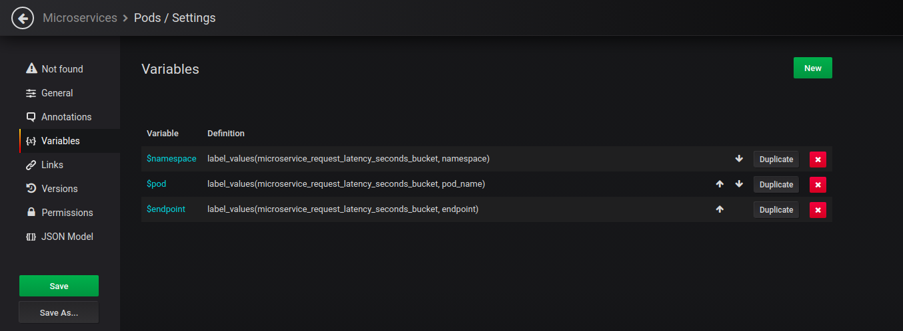
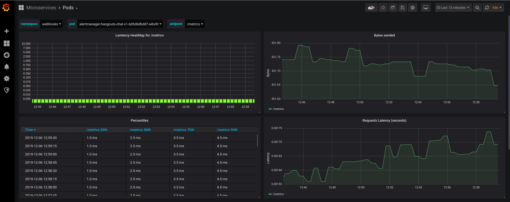

# prom-http-proxy
*prom-http-proxy* is an example of Python HTTP Proxy with Prometheus metrics. The goal is to used it in Kubernetes Pods as a sidecar to monitor a microservice.

See the examples to understand how to implement it.

# Prometheus export metrics:
- microservice_endpoint_request_total (Counter)
- microservice_bytes_total (Counter)
- microservice_request_latency_seconds (Histogram)

# Examples PromQL for Grafana:
- **Panel "Lantency HeatMap for $endpoint"**
   - `rate(microservice_request_latency_seconds_bucket{namespace="$namespace", pod_name="$pod", le!="+Inf", endpoint="$endpoint"}[5m])`
- **Panel "Bytes sended"**
   - `sum by (endpoint, pod_name) (rate(microservice_bytes_total{namespace="$namespace",pod_name="$pod", endpoint="$endpoint"}[5m]))`
- **Panel "Percentiles"**
   - `histogram_quantile(0.2, rate(microservice_request_latency_seconds_bucket{namespace="$namespace", pod_name="$pod", endpoint="$endpoint"}[5m]))`
   - `histogram_quantile(0.5, rate(microservice_request_latency_seconds_bucket{namespace="$namespace", pod_name="$pod", endpoint="$endpoint"}[5m]))`
   - `histogram_quantile(0.7, rate(microservice_request_latency_seconds_bucket{namespace="$namespace", pod_name="$pod", endpoint="$endpoint"}[5m]))`
   - `histogram_quantile(0.9, rate(microservice_request_latency_seconds_bucket{namespace="$namespace", pod_name="$pod", endpoint="$endpoint"}[5m]))`
- **Panel "Request latency (seconds)"**
   -  `rate(microservice_request_latency_seconds_sum{namespace="$namespace", pod_name="$pod", endpoint="$endpoint"}[5m])`
      `/`  
      `rate(microservice_request_latency_seconds_count[5m])`

# Grafana Dashboard variables:

# Example Grafana capture:
